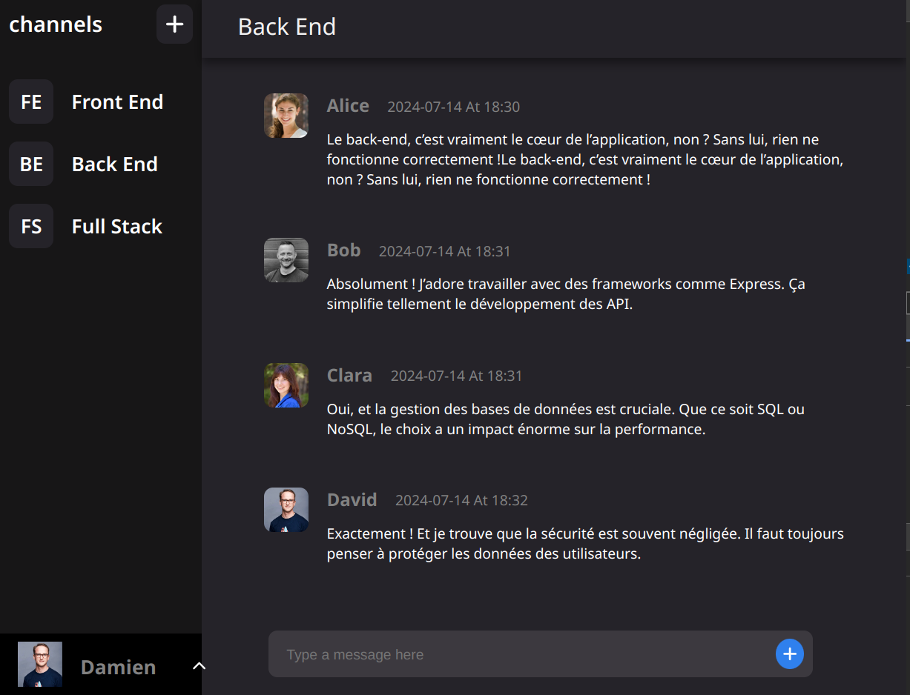

# Chat_Group

A user-friendly chat application that allows users to communicate and manage their profiles effectively.

## Features

- **Account Creation**: Users can sign up and create their own accounts.
- **Login**: Securely access your account with a login system.
- **User Profile**: View and modify your profile information as needed.
- **Profile Picture Upload**: Upload a profile picture from your computer to personalize your account.
- **Real-Time Chat**: Access existing chat channels or create new ones to discuss with other users.
- **Send Messages**: Share your thoughts and messages in the selected channels.

## Technologies Used

- **Frontend**: React
- **Backend**: Express.js
- **Database**: MongoDB
- **Image Management**: Cloudinary
- **Authentication**: JSON Web Tokens (JWT)
